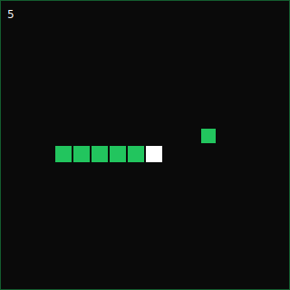
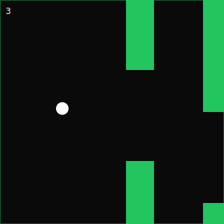
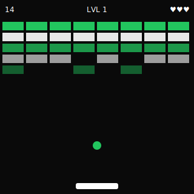
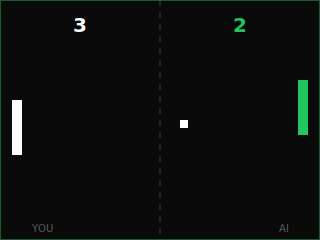
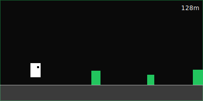
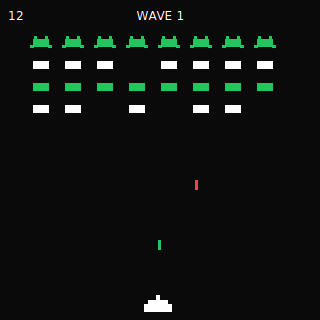

# load-games

Tiny canvas games designed to fill loading states, empty states, and idle screens. Framework-agnostic core + optional React wrapper. Each game is its own package — install only what you ship.

**[▶ Live demo](https://viren-vii.github.io/load-games/)** · **[npm](https://www.npmjs.com/org/load-games)** · MIT

<p>
  <a href="https://viren-vii.github.io/load-games/?game=snake"></a>
  <a href="https://viren-vii.github.io/load-games/?game=flappy"></a>
  <a href="https://viren-vii.github.io/load-games/?game=breakout"></a>
  <a href="https://viren-vii.github.io/load-games/?game=pong"></a>
  <a href="https://viren-vii.github.io/load-games/?game=runner"></a>
  <a href="https://viren-vii.github.io/load-games/?game=space-invaders"></a>
</p>

Each preview links to the live demo with that game pre-selected.

## Packages

| Package | Purpose | Size goal (gzip) |
|---|---|---|
| [`@load-games/core`](packages/core) | `BaseEngine`, `GameLoop`, `InputManager`, shared types | < 3 KB |
| [`@load-games/react`](packages/react) | `<GameCanvas/>` wrapper | < 1 KB + peer deps |
| [`@load-games/snake`](packages/snake) | Classic snake | < 2 KB |
| [`@load-games/flappy`](packages/flappy) | Flappy clone | < 2 KB |
| [`@load-games/breakout`](packages/breakout) | Breakout / Arkanoid | < 2 KB |
| [`@load-games/pong`](packages/pong) | 1-player vs CPU pong | < 2 KB |
| [`@load-games/runner`](packages/runner) | Endless dino-runner | < 2 KB |
| [`@load-games/space-invaders`](packages/space-invaders) | Space Invaders | < 2 KB |

Each game depends only on `@load-games/core`. No cross-game imports.

## Usage (npm)

```bash
pnpm add @load-games/react @load-games/core @load-games/snake
```

Bundled UX (canvas + external skip button):

```tsx
import { LoadingGame } from '@load-games/react'
import { SnakeEngine } from '@load-games/snake'

export function Loader({ done, content }) {
  if (!showGame) return content
  return (
    <LoadingGame
      engine={SnakeEngine}
      width={320}
      height={320}
      ready={done}                             // your work is done
      onDismiss={(score, reason) => setShowGame(false)}  // user tapped continue, or skipped
      skipLabel="Skip — show me the content"   // optional
    />
  )
}
```

Or compose your own UI around the raw canvas:

```tsx
import { GameCanvas } from '@load-games/react'
import { SnakeEngine } from '@load-games/snake'

export function Loader() {
  return (
    <GameCanvas
      engine={SnakeEngine}
      width={320}
      height={320}
      speed={5}
      onScore={(n) => console.log('score', n)}
    />
  )
}
```

Vanilla (no React):

```ts
import { SnakeEngine } from '@load-games/snake'
const canvas = document.querySelector('canvas')!
const engine = new SnakeEngine(canvas, { width: 320, height: 320 })
engine.start()
```

### Customizing labels

Every visible string can be overridden — useful for i18n, brand voice, or per-app copy:

```tsx
<LoadingGame
  engine={SnakeEngine}
  ready={done}
  labels={{
    idleStart:   'tippe um zu starten',
    idleReady:   'fertig · tippen zum fortfahren',
    gameOver:    'VORBEI',
    tapRestart:  'erneut tippen',
    tapContinue: 'tippen für inhalt →',
    readyBadge:  '● BEREIT',
    tapServe:    'tippen zum aufschlag',
  }}
  skipLabel="Überspringen"
  onDismiss={() => setShowGame(false)}
/>
```

Missing keys fall back to defaults (English).

## The graceful-handoff problem

You're showing a game while an AI generates a response (or any async work). When the response lands, you don't want to rip the game away mid-life — the player has a high-score run going. You also can't wait forever; the user is waiting for content.

`<GameCanvas/>` solves this with a **`ready` signal** + a **`onDismiss` callback**. The contract:

1. **You set `ready={true}`** when your underlying work finishes.
2. The game shows a small pulsing **"● READY"** badge top-right — non-intrusive.
3. The current life continues uninterrupted.
4. On the next game-over, the "tap to restart" prompt becomes **"tap to continue →"**.
5. Player taps → **`onDismiss(score)`** fires → you unmount the canvas and show your content.

Player feels in control. Content arrives the moment they're done. No abrupt cut.

```tsx
import { useState } from 'react'
import { GameCanvas, type GameHandle } from '@load-games/react'
import { SnakeEngine } from '@load-games/snake'

function AskAI({ prompt }: { prompt: string }) {
  const [response, setResponse] = useState<string | null>(null)
  const [showGame, setShowGame] = useState(true)
  const gameRef = useRef<GameHandle>(null)

  useEffect(() => {
    fetchAI(prompt).then(setResponse)
  }, [prompt])

  // Optional escape hatch: if user ignores the ready badge for 30s, force-dismiss.
  useEffect(() => {
    if (!response) return
    const t = setTimeout(() => gameRef.current?.dismiss(), 30_000)
    return () => clearTimeout(t)
  }, [response])

  if (!showGame) return <Markdown>{response}</Markdown>

  return (
    <GameCanvas
      ref={gameRef}
      engine={SnakeEngine}
      width={320} height={320}
      ready={response !== null}                  // ← declarative signal
      onDismiss={(finalScore) => {
        track('game.dismissed', { finalScore })
        setShowGame(false)                       // ← swap in your content
      }}
    />
  )
}
```

### `GameHandle` imperative API (via ref)

| Method | When to use |
|---|---|
| `signalReady()` | Same as `ready={true}` prop, for non-React or imperative flows. |
| `dismiss()` | Force-exit now (fires `onDismiss(currentScore)`). Use as a timeout fallback. |
| `pause()` / `resume()` | Manual pause control (engine also auto-pauses on tab-hide and off-screen). |
| `getScore()` | Read current score without subscribing to `onScore`. |
| `getState()` | `'idle' \| 'running' \| 'paused' \| 'gameover'`. |
| `isReady()` | Has `signalReady()` been called? |

## Complete prop reference

### `<GameCanvas/>` props

Extends every field of `GameConfig` (see below) plus:

| Prop | Type | Default | Effect |
|---|---|---|---|
| `engine` | `EngineClass` | (required) | The engine class to instantiate — pass the class itself, not an instance. |
| `ready` | `boolean` | `false` | When `true`, calls `engine.signalReady()`. Shows ready badge, swaps gameover prompt to "tap to continue". |
| `className` | `string` | `undefined` | Forwarded to `<canvas>`. |
| `style` | `React.CSSProperties` | `undefined` | Merged onto the canvas's base style. |

### `<LoadingGame/>` props

Everything `<GameCanvas/>` accepts, plus:

| Prop | Type | Default | Effect |
|---|---|---|---|
| `skipButton` | `boolean` | `true` | Render the external "Skip" button next to the canvas. |
| `skipLabel` | `string` | `"Skip"` | Button text. |
| `skipPosition` | `'top' \| 'bottom' \| 'right'` | `'bottom'` | Position relative to canvas. Uses flex direction internally. |
| `skipButtonStyle` | `React.CSSProperties` | `{}` | Inline style override for the button. |
| `wrapperStyle` | `React.CSSProperties` | `{}` | Inline style override for the wrapping flex div. |

### `GameConfig` fields (passed through both components)

Configuration for the underlying engine. **Captured on mount — config changes after mount don't take effect; remount via React `key` to apply new values.**

| Field | Type | Default | Effect |
|---|---|---|---|
| `width` | `number` | container or 300 | Canvas width in CSS pixels. |
| `height` | `number` | container or 300 | Canvas height in CSS pixels. |
| `speed` | `number` | `5` | Difficulty / pace (1–10, clamped). Game-specific interpretation. |
| `theme` | `Partial<GameTheme>` | inherits `DEFAULT_THEME` | Override `bg`, `primary`, `accent`, `text` (hex strings). Partial; missing keys inherit. |
| `labels` | `Partial<GameLabels>` | inherits `DEFAULT_LABELS` | Override visible strings. Partial. See [GameLabels](#gamelabels) below. |
| `returnButton` | `boolean` | `true` | Whether the in-canvas "● READY" badge is clickable as an exit when `ready` + running. |
| `onScore` | `(score: number) => void` | — | Score changed (de-duplicated against last value). |
| `onGameOver` | `(score: number) => void` | — | Player died / failed a life. |
| `onReady` | `() => void` | — | Host signalled ready (analytics hook, fires once). |
| `onPause` | `() => void` | — | Game paused (tab hide, off-screen, programmatic). |
| `onResume` | `() => void` | — | Game resumed from paused. |
| `onDismiss` | `(score: number, reason: DismissReason) => void` | — | Game exited. See reasons below. |

#### `DismissReason`

| Value | Meaning |
|---|---|
| `'user'` | Player tapped the in-canvas return button mid-play (or pressed `Esc`). |
| `'gameover'` | Player died and tapped the "continue" prompt. |
| `'idle-ready'` | Content arrived before player started; player tapped the idle screen to skip. |
| `'forced'` | Host called `engine.dismiss()` directly (timeout fallback, content-now button, etc). |

#### `GameLabels`

| Key | Default |
|---|---|
| `idleStart` | `"tap / press any key to start"` |
| `idleReady` | `"content ready · tap to continue"` |
| `gameOver` | `"GAME OVER"` |
| `tapRestart` | `"tap to restart"` |
| `tapContinue` | `"tap to continue →"` |
| `readyBadge` | `"● READY"` |
| `tapServe` | `"tap to serve"` |

Override any subset; the rest use defaults. `import { DEFAULT_LABELS } from '@load-games/core'` if you need to read the defaults.

### `GameHandle` (via `ref`)

| Method | Returns | Effect |
|---|---|---|
| `pause()` | `void` | Pause the game (idempotent if already paused). |
| `resume()` | `void` | Resume from paused (idempotent). |
| `signalReady()` | `void` | Same as `ready={true}` — for non-React or imperative use. Idempotent. |
| `dismiss()` | `void` | Force-exit. Fires `onDismiss(score, 'forced')`. Idempotent. |
| `getScore()` | `number` | Current score without subscribing to `onScore`. |
| `getState()` | `GameState` | `'idle' \| 'running' \| 'paused' \| 'gameover'`. |
| `isReady()` | `boolean` | Has `signalReady()` been called? |

Inline callbacks are safe — the wrapper captures the latest via ref each render, so writing `onScore={n => setScore(n)}` directly does **not** recreate the engine.

### Edge cases playbook

These are the scenarios you'll hit when wiring a game into a real loading flow. Recommended pattern for each:

**1. Long load — user might wait forever.** Add a timeout fallback so the canvas can't trap your UI:

```tsx
useEffect(() => {
  if (!response) return
  const t = setTimeout(() => gameRef.current?.dismiss(), 30_000)
  return () => clearTimeout(t)
}, [response])
```

**2. Fast load — content lands before player starts.** State will be `idle + ready`. Engine swaps the idle prompt to "content ready · tap to continue" automatically; tap fires `onDismiss(0, 'idle-ready')`.

**3. Player wants out, content not ready.** Use `<LoadingGame skipButton/>` which renders an external "Skip" button. Click triggers `onDismiss(score, 'forced')`. Your host decides what to do — show a placeholder, fast-track the work, or fall back to a different UI.

**4. Player is killing it on a high-score run, content has been ready 30s.** The return button (top-right "● READY" badge) is clickable mid-play — single tap to bail. Set `returnButton: false` if you want to force the player to play to game-over.

**5. Player accidentally taps and game starts, instantly regrets.** Press `Esc` to dismiss. Mouse → tap return button. Both fire `onDismiss(0, 'user')`.

**6. Game paused during ready signal.** State stays paused (tab hidden, etc). When player returns and engine resumes, badge appears retroactively. `onPause` / `onResume` callbacks let you log this gap for analytics.

## Behavior contract

- **Engine config is captured on mount.** Changing `width` / `height` / `speed` / `theme` after mount does **not** reinitialise the game (would interrupt play). To apply new config, force a remount via React `key`.
- **Engine instance is stable across renders.** Only the `engine` class prop being a different reference triggers reinit.
- **Lifecycle is bidirectional.** Engine auto-pauses on tab hide and when canvas scrolls off-screen, then auto-resumes when visible again.

## SSR (Next.js / Remix)

`<GameCanvas/>` is client-only (marked `'use client'`). All canvas work runs inside `useEffect`, so importing it from a server component is fine if the consumer file is also `'use client'`. From a pure server component, use a dynamic import:

```tsx
import dynamic from 'next/dynamic'
const Loader = dynamic(() => import('./Loader'), { ssr: false })
```

Engine classes themselves (`SnakeEngine` etc.) never reference `window` at module scope — only inside the constructor, which only runs once a canvas exists. Importing the class on the server is harmless.

## Sizing

The canvas reads `width` / `height` from `GameConfig` if set, otherwise from `getBoundingClientRect()` at mount, falling back to 300×300. There is no `ResizeObserver` — if the container resizes after mount, the canvas stays at its mounted size. For a responsive game, watch your container's size in React and bump a `key` prop to remount the canvas at the new dimensions.

## Performance

- Single `requestAnimationFrame` loop per engine, capped at 100ms `dt` to survive tab resumes.
- All engines use single-pass scans — no per-frame array allocations (`.filter()` / `.map()` etc.).
- `onScore` fires only on actual change, never per-frame.
- Canvas is DPR-aware: backing store scaled by `devicePixelRatio` for crisp pixels on retina.
- Per-package bundle size is ~1–2 KB gzip (core: ~3 KB). All packages have `sideEffects: false` for tree-shaking.

## Structure plan

Two distribution paths supported, **npm is the source of truth**:

### npm (primary)

- Each package published independently under the `@load-games` scope.
- Versioned together via Changesets (`"fixed": [["@load-games/*"]]`) — one minor bump bumps everything. Keeps cross-package compat trivial.
- Targets: ESM + CJS + `.d.ts` via `tsup`. `sideEffects: false` for tree-shaking.
- Peer deps: `@load-games/react` peers on `react@>=18`. Core/game packages have no runtime deps beyond `@load-games/core` itself.

### CDN (secondary, future)

Once npm is stable, ship UMD bundles via jsDelivr/unpkg automatically:

```
https://cdn.jsdelivr.net/npm/@load-games/snake@latest/dist/loadgames-snake.umd.js
```

Plan:

1. Add a second tsup entry per game producing `dist/loadgames-<name>.umd.js` with `globalName: 'LoadGamesSnake'` etc.
2. Mark `@load-games/core` external in UMD build, ship one `loadgames-core.umd.js` separately. End users include both:
   ```html
   <script src="https://cdn.jsdelivr.net/npm/@load-games/core/dist/loadgames-core.umd.js"></script>
   <script src="https://cdn.jsdelivr.net/npm/@load-games/snake/dist/loadgames-snake.umd.js"></script>
   <script>const e = new LoadGamesSnake.SnakeEngine(canvas, {}); e.start()</script>
   ```
3. Optional mega-bundle `@load-games/all` package — re-exports every engine. One `<script>`, ~15 KB gzip. Tradeoff: forfeits tree-shaking; only suitable for "load screen with random game" use case.

CDN bundles get added in a follow-up PR after npm publish stabilises. Engine API is the same regardless of distribution.

## Development

```bash
pnpm install
pnpm build        # build all packages (turbo)
pnpm typecheck
pnpm test
pnpm --filter @load-games/demo dev   # local playground at http://localhost:5173
```

### Adding a game

1. `cp -r packages/snake packages/<name>` then edit `package.json` name + description.
2. Extend `BaseEngine`. Implement `gameName`, `controlHints`, `update(dt)`, `render()`.
3. Wire input via `InputManager`. Call `beginGame()` on first input, `restartGame()` on retry.
4. Add a tab to `apps/demo/src/App.tsx`.
5. Add a changeset: `pnpm changeset`.

### Releasing

1. `pnpm changeset` — describe changes, pick bump level.
2. Push / merge PR with the changeset file.
3. Release workflow opens a "Version packages" PR aggregating all pending changesets.
4. Merge that PR. Workflow re-runs, sees no changesets pending, publishes to npm.

### Publishing auth

npm Trusted Publishing (OIDC) — no long-lived tokens stored as secrets. The release workflow has `id-token: write`, the npm CLI in the runner mints a short-lived OIDC token and the npm registry verifies it against a Trusted Publisher configured on each `@load-games/*` package:

- Publisher: GitHub Actions
- Owner: `viren-vii`
- Repository: `load-games`
- Workflow filename: `release.yml`

Every published tarball carries a SLSA Provenance v1 attestation tying it to the exact workflow run + commit SHA, visible as a "Provenance" badge on npmjs.com.

Setup is per-package and one-time — configured at https://www.npmjs.com/package/@load-games/{pkg}/access. New packages added later need their own Trusted Publisher entry on first publish.

### Pages

GitHub Pages is auto-enabled by the workflow itself (`actions/configure-pages@v5` with `enablement: true`). On the first push to `main` it enables Pages and deploys the demo. Subsequent pushes just deploy.

## Status by package

All packages build. Core has 32 unit tests across engine (ready/dismiss state machine, pause/resume, labels), input (keyboard/pointer mapping, swipe, multi-touch), and timing (dt cap, idempotency). Snake has 2 collision tests. Other engines rely on the demo for behavioural verification. Coverage target: 60%+ before 1.0.

## License

MIT — see [LICENSE](LICENSE).
